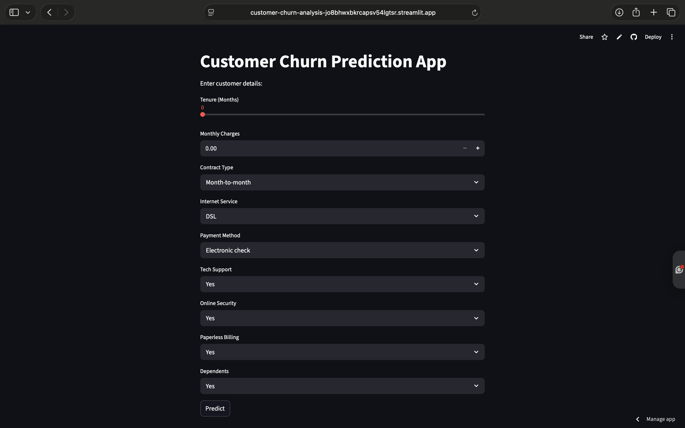

# Customer Churn Prediction App

## Overview
This project predicts whether a customer will churn based on their service details.

It is built using Machine Learning and deployed using Streamlit.

---

## Tech Stack
- Python
- Pandas
- NumPy
- Scikit-learn
- Streamlit

---

## Features
- Real-time churn prediction
- Interactive UI
- ML model integration
- Cloud deployment

---

## How It Works
- User enters customer details
- Data is preprocessed
- Trained ML model predicts churn probability
- Output shows whether customer will churn or not

--

## Model Details
- Algorithm: Random Forest / Logistic Regression
- Dataset: Telco Customer Churn Dataset
- Features used: tenure, monthly charges, contract type, etc.

—

## Sample Prediction
Example:
- Input: Tenure = 2 months, Monthly Charges = 80
- Output: High chance of churn

---

## Live App
https://customer-churn-analysis-jo8bhwxbkrcapsv54lgtsr.streamlit.app
## App Preview

---

## Project Structure
- app.py → Streamlit app
- churn_analysis.ipynb → Model training
- model.pkl → ML model
- requirements.txt → Dependencies

---

## Run Locally
pip install -r requirements.txt
streamlit run app.py

---

## Author
Mohammed Shadid